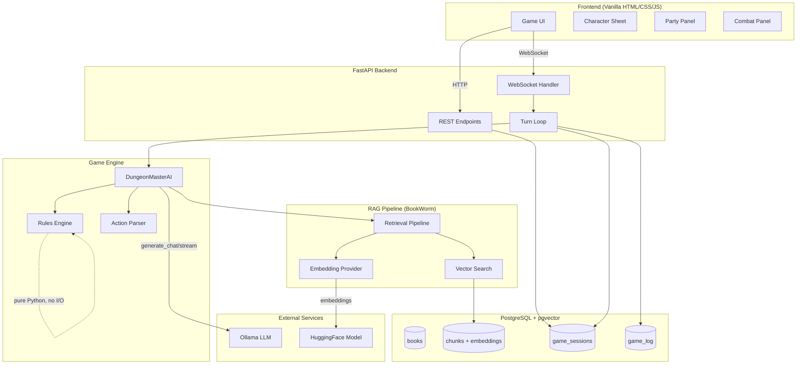
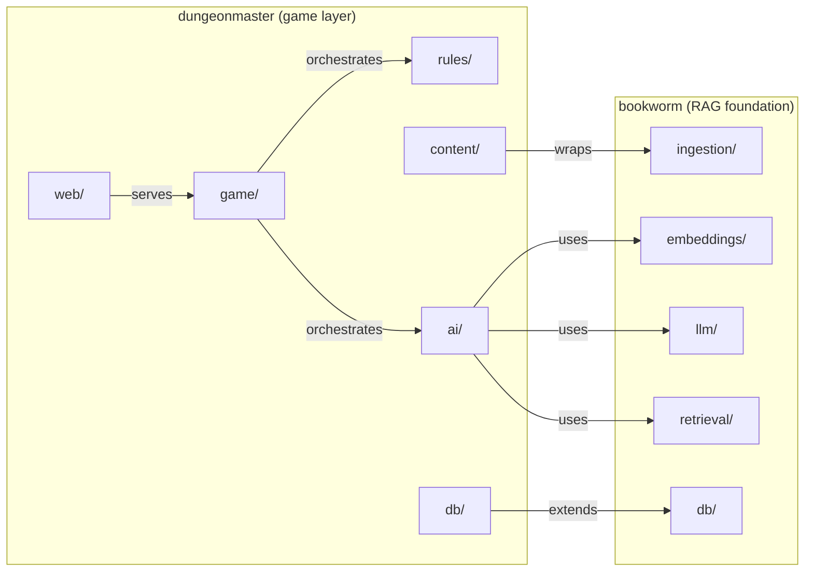
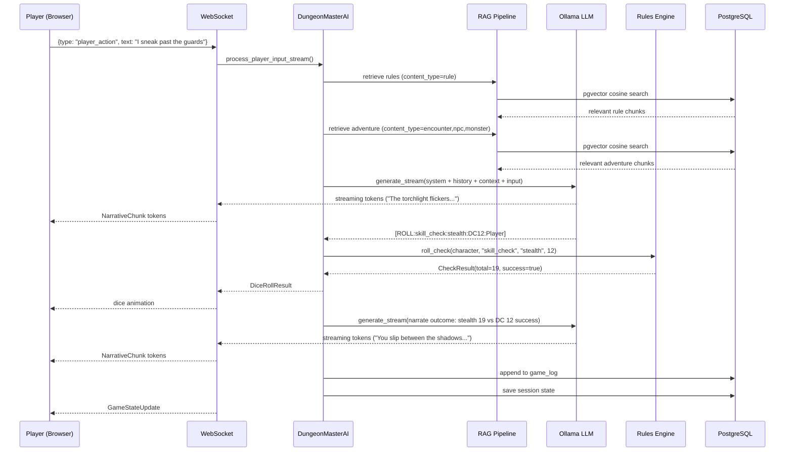
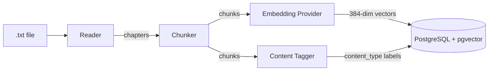
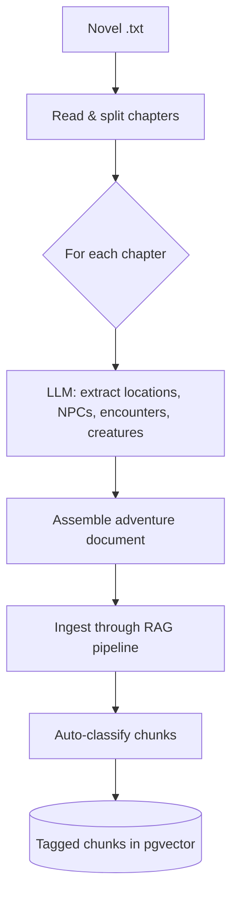
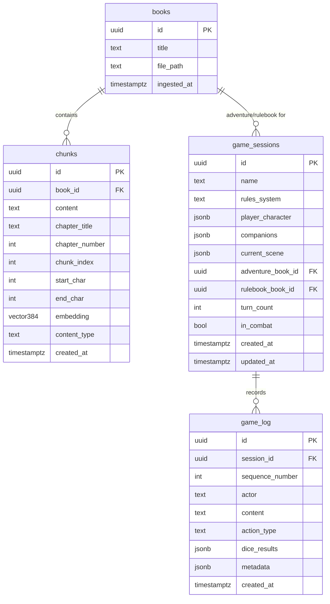
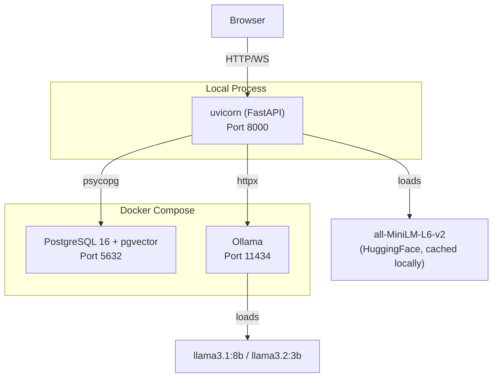

# System Architecture

## Overview

Dungeon Master is a single-player AI-powered tabletop RPG built on top of BookWorm, a local-first RAG (Retrieval-Augmented Generation) system. The system ingests rulebooks and adventure content, then uses an AI Game Master to run interactive narrative gameplay with deterministic mechanical resolution.

## High-Level Architecture

## Package Relationship

`dungeonmaster` is a **consumer** of `bookworm`, not a child. It imports bookworm's providers and pipelines through their public Protocol interfaces.

## Turn Resolution Flow

## Data Flow: Content Ingestion

## Data Flow: Book-to-Adventure Conversion

## Database Schema

## Deployment

## Key Interfaces (Protocols)

All three core abstractions use Python's `Protocol` for structural typing — no inheritance required.

| Protocol | File | Methods | Implementations |
|----------|------|---------|----------------|
| `EmbeddingProvider` | `bookworm/embeddings/base.py` | `embed_texts()`, `embed_query()` | `TransformerEmbeddingProvider` (local HuggingFace) |
| `LLMProvider` | `bookworm/llm/base.py` | `generate()`, `generate_chat()`, `generate_stream()` | `OllamaProvider` (HTTP REST) |
| `RulesEngine` | `dungeonmaster/rules/base.py` | `roll_check()`, `resolve_attack()`, `create_character()`, `get_rules_summary()`, ... | `DnD5eEngine` (D&D 5th Edition) |
